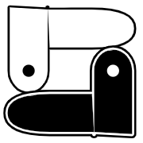

#  Snakeshift

A cross between Snake and Shift.

An inverse space puzzle game.

Shapeshift in makeshift ways. Shift snakes into lakes. Snake wakes into shapes.

Skin and fang. Yin and yang. Snakes shelter sneks like sheds, then shed kin like skin.

## Controls

### Mouse/Pen/Touch

Click on a cell to move to it.

NOTE: KEYBOARD IS NEEDED FOR SOME CONTROLS CURRENTLY.

### Gamepad

Use the left stick to point in the direction you want to move, and then press A to move to the highlighted cell.
Or use the D-pad to move.

Shoulder buttons switch snakes.

Press ⓧ to undo, Ⓑ to redo.  
Press Ⓨ to restart the level.

You may need to press a button to activate the gamepad, before the web page can see it.

NOTE: Gamepad is not yet supported in the menus or the level editor.

### Keyboard

You can use the arrow keys, WASD, HJKL, or the number pad to move.

<kbd>Tab</kbd> switches between snakes.

Press <kbd>Z</kbd> to undo, <kbd>Y</kbd> to redo.

Press <kbd>R</kbd> to restart the level. This is undoable.

Press <kbd>`</kbd> to toggle the level editor.

Press <kbd>Ctrl+S</kbd> to save the level, and <kbd>Ctrl+O</kbd> to open a level.

## Project Structure

This project uses [Vite](https://vitejs.dev/) and [TypeScript](https://www.typescriptlang.org/).

- `/game/` — the source code.
- `/dist/` — the built files, which could be deployed to a static web server.
- Files in `/public/` will be copied to the `/dist/` directory when building. These are referenced as absolute paths, without the `/public` prefix, since they're copied to the root of the `/dist/` directory.
- `/tsconfig.json` — Typescript settings.
- `/eslintrc.cjs` — ESLint settings.
- `/package.json` — dependencies and scripts.
  - `/package-lock.json` — generated file, used for reproducible builds.
- `/cspell.json` — spell check settings and dictionary.

## Development

Install dependencies and run the dev server:

```sh
npm install
npm run dev
```

### Quality Control

This command runs the spell checker, the typescript compiler, and eslint:

```sh
npm run lint
```

### Ideas

- slicing snakes
  - like the ghost peppers in [Ssspicy!](https://torcado.itch.io/ssspicy) but without awkward turn counter timing, it will slice your body into live and dead parts, and the dead parts will retain their shapes will be able to be pushed around like arbitrarily shaped crates
  - generalizes crates, so could do away with crates
  - cutting blade and cut button combo?
  - shown as a scythe perhaps, as a way to visually indicate a specific side of a tile that will be cut (and cut button as a skull and crossbones? or skull by itself? or skull in a hood? or crossed scythes / otherwise "contained" looking scythe(s)?)
- portals
  - entrance and exit of different sizes changing your snake's size, like in [PortalSnake](https://bcat112a.itch.io/portalsnake)
- snake color changer
  - shown as hourglass-like twist with particles of light/dark going in/out
- generalization of color changer and portals
  - shown as conic (hourglass-like when 1 cell) twist with black/white braided wormhole leading to other portal (which can be the same cell) and which can be the same or a different color and the same or a different size and the same or a different orientation
  - what if it could act as the slicer too, with razor-sharp sections of the wormhole aligned to grid edges? you would go through the wormhole with a snake to slice a snake crossing the wormhole blades

