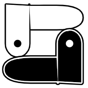

#  Snakeshift

A negative space puzzle game inspired by Snake and Shift.

Shapeshift in makeshift ways. Shift snakes into lakes. Snake wakes into shapes.

Skin and fang. Yin and yang. Snakes shelter sneks like sheds, then shed kin like skin.

## Play the Game

[Play Snakeshift](https://1j01.github.io/snakeshift/) in your browser.

## Controls

### Mouse/Pen/Touch

| Action             | Controls                                                                   |
| ------------------ | -------------------------------------------------------------------------- |
| Move               | Drag anywhere on the screen. You can move multiple directions in one drag. |
| Switch Snakes      | Click/tap on a snake                                                       |
| Undo               |  button in toolbar                 |
| Redo               |  button in toolbar                 |
| Restart (Undoable) |  button in toolbar           |

### Gamepad

| Action             | Controls                                                 |
| ------------------ | -------------------------------------------------------- |
| Move               | Hold left stick in a direction and press Ⓐ, or use D-pad |
| Switch Snakes      | Shoulder buttons                                         |
| Undo               | ⓧ                                                        |
| Redo               | Ⓑ                                                        |
| Restart (Undoable) | Ⓨ                                                        |

You may need to press a button on the gamepad before the web page can see it.

NOTE: The level editor does not currently support gamepad controls.

### Keyboard

| Action             | Controls                                    |
| ------------------ | ------------------------------------------- |
| Move               | Arrow keys, WASD, vi keys (HJKL), or Numpad |
| Switch Snakes      | <kbd>Tab</kbd>                              |
| Undo               | <kbd>Z</kbd>                                |
| Redo               | <kbd>Y</kbd>                                |
| Restart (Undoable) | <kbd>R</kbd>                                |
| Toggle Editor      | <kbd>`</kbd>                                |

The level editor supports these standard shortcuts:
| Action     | Controls          |
| ---------- | ----------------- |
| Save       | <kbd>Ctrl+S</kbd> |
| Open       | <kbd>Ctrl+O</kbd> |
| Copy       | <kbd>Ctrl+C</kbd> |
| Cut        | <kbd>Ctrl+X</kbd> |
| Paste      | <kbd>Ctrl+V</kbd> |
| Select All | <kbd>Ctrl+A</kbd> |
| Delete     | <kbd>Delete</kbd> |

## Project Structure

This project uses [Vite](https://vitejs.dev/) and [TypeScript](https://www.typescriptlang.org/).

- `/game/` — the source code.
- `/game/dist/` — the built files, which could be deployed to a static web server.
- `/public/`  — Files in this folder will be copied to the `dist` directory when building. These are referenced with absolute paths in CSS, but relative paths in HTML and JS, without the `/public` prefix in either case.
- `/tests/` — Playwright tests.
- `/tsconfig.json` — Typescript settings.
- `/eslintrc.cjs` — ESLint settings.
- `/vite.config.js` — Vite settings.
- `/package.json` — dependencies and scripts.
  - `/package-lock.json` — generated file, used for reproducible builds.
- `/cspell.json` — spell check settings and dictionary.

## Development

Install dependencies and run the dev server:

```sh
npm install
npm run dev
```

### Quality Control

This command runs the spell checker, the typescript compiler, and eslint:

```sh
npm run lint
```

This command will run tests using Playwright:

```sh
npm run test
```

Learn more about [Playwright's philosophy and tooling](https://playwright.dev/docs/best-practices).  
It has great VS Code integration, a test recorder/generator, a trace viewer including screen capture replay, and more.

### File Format Versioning

When the file format changes, increment `FORMAT_VERSION` and add an upgrade step for backwards compatibility in `game-state.ts`.

To update all levels to the new format, run:

```sh
npm run update-level-format
```

### Deployment

To build for production and push to GitHub Pages:
```sh
npm run deploy
```

### Ideas and TODOs

See [TODO.md](./TODO.md).

## License

This project is licensed under the MIT License. See the [LICENSE.txt](./LICENSE.txt) file for details.

